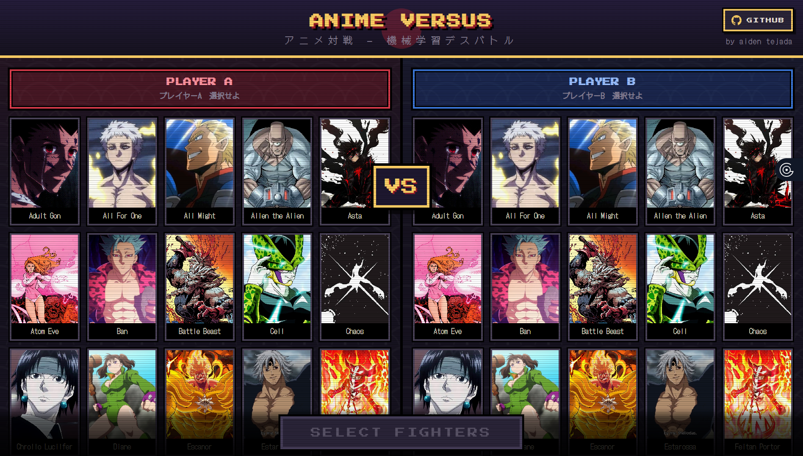
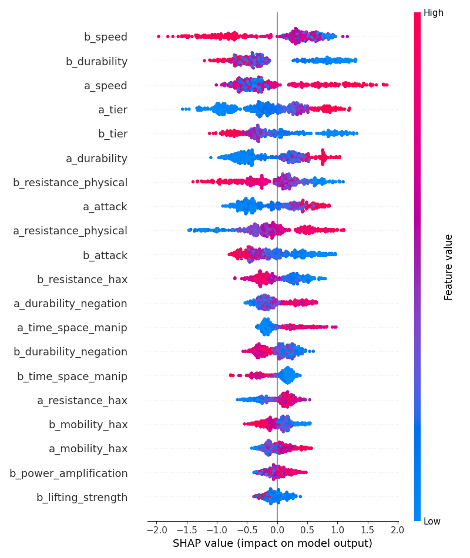

# Anime Versus ML

**A machine-learning engine that predicts the winner of cross-universe anime 1v1 death battles — and explains *why* it made the call.**

An XGBoost classifier trained on ~2,300 hand-curated matchups learns its own powerscaling logic from raw character stats, SHAP surfaces the factors behind each verdict, and an LLM turns those factors into a lore-accurate fight narration. Wrapped in a FastAPI backend with a retro-Japanese pixel frontend.

**Live at [versus.aidentejada.com](https://versus.aidentejada.com)**



---

## The core idea

The naive version of this project is: assign every character stats, hardcode a formula (`if my_attack > your_durability: win`), done. That's useless — it just plays back my own biases, and anime combat is far too nuanced for a hand-tuned formula (different power types, hax, speed blitzing, environmental factors, durability negation).

So the design flips it around:

1. **I provide the raw stats** — but never tell the model how to weigh them.
2. **An LLM labels the winners** from lore/canon alone (character names only, *no stats shown*), acting as a stand-in for community powerscaling consensus.
3. **XGBoost reverse-engineers the relationship** between the stats and those outcomes — discovering on its own that (e.g.) a large enough speed gap overrides an attack-potency disadvantage.

The model isn't fitting my formula. It's learning the *implicit* formula behind thousands of consensus judgments. That's what makes it more than a glorified lookup table.

---

## Data pipeline

Everything is hand-curated — there was no usable dataset for this, and scraping produced garbage, so I collected it manually to guarantee quality.

**1. Character stats (69 fighters, manually pulled from the VS Battles wiki).**
Each character is scored in a *specific* form (Baryon Mode Naruto, Black Frieza, Rune King Thor, etc.). Physical stats like tier, attack, durability, and speed are derived numerically — `log10(midpoint of the wiki's Joule/energy range)` plus modifiers — so word-tiers like "Planet level" or "Massively FTL+" become continuous features. Full methodology in [`POWER_SCALE.md`](POWER_SCALE.md).

**2. Ability / "hax" scoring (the differentiator).**
Characters in the same universe often share a tier, so raw AP can't separate them. Eight ability columns capture *how* they win — `durability_negation`, `regeneration`, `power_amplification`, `mobility_hax`, `time_space_manip`, `mind_soul_hax`, `resistance_physical`, `resistance_hax`. These were scored by **Claude Sonnet** (deep domain reasoning) via [`src/llm_request.py`](src/llm_request.py).

**3. Matchup generation & labeling.**
[`src/matchup_maker.py`](data/matchup_maker.py) builds every unique pairing (2,346 combinations). Each was labeled `1`/`0` (A wins / B wins) by an LLM judging **on lore alone, blind to the numerical stats** — forcing the model to later discover the stat weightings itself rather than being handed them.

---

## The model

**Algorithm:** `XGBoost` gradient-boosted trees — chosen for capturing non-linear stat interactions and threshold logic (e.g. "a speed advantage only matters past a certain gap"), which linear models can't express.

**Fighting data leakage.**
To eliminate positional bias (the model shouldn't care whether a fighter is listed as "A" or "B"), the data is **mirrored** — every `A vs B → winner` becomes `B vs A → flipped winner`, doubling the set. The subtle trap: mirroring *before* splitting leaks the same matchup into both train and test. The fix is to **split first, then mirror only the training half**, keeping the test set genuinely unseen:

```python
X_train, X_test, y_train, y_test = train_test_split(X, y, test_size=0.2, random_state=42)
# mirror ONLY the training data — test set stays clean
X_mirror = X_train.rename(columns=flip_ab)[X_train.columns]
y_mirror = 1.0 - y_train
X_train = pd.concat([X_train, X_mirror]); y_train = pd.concat([y_train, y_mirror])
```

Correcting this leak *raised* accuracy — the leak had been propping up a worse model.

**Tuning.** `GridSearchCV` over 432 combinations (`learning_rate`, `max_depth`, `subsample`, `colsample_bytree`, `min_child_weight`) with 5-fold CV, plus early stopping.

**Result: 92.98% accuracy** on the clean, leak-free hold-out split.

---

## Explainability (SHAP)

Accuracy alone doesn't earn trust — so every prediction is decomposed with **SHAP** (TreeExplainer) to show exactly which stats drove it.



The global picture matches powerscaling intuition: **speed** (`a_speed` / `b_speed`) is the single most influential family of features — reflecting how often a speed blitz simply ends a fight before stats matter — followed by **durability** and **tier**, then resistances and attack. The model taught itself that being fast enough to land the first decisive hit frequently outweighs a raw power disadvantage.

At inference time, the top 5 SHAP factors for the *specific* matchup are extracted and shown to the user as the "deciding factors."

---

## LLM narration layer

Raw SHAP values mean nothing to a casual viewer, so those factors are fed to an LLM (**`gpt-oss-120b` via Groq**, streamed live) to narrate the fight in VS-Battles style.

To stop the LLM from hallucinating tropes, each character carries a hand-vetted **canon mechanics note** (how they actually win/lose), and the prompt injects the raw side-by-side stat values with `[TIED]` markers so the narrator respects the numbers (SHAP *importance* ≠ a stat *gap*). The result is a fight breakdown grounded in both the model's math and the characters' real abilities.

---

## Custom fighters

Either side of a matchup can be a fighter you build yourself — click the **"?" card** at the end of the roster:

1. Look the character up on the [VS Battles Wiki](https://vsbattles.fandom.com/wiki/VS_Battles_Wiki). Their profile lists the exact wording the builder uses — Tier / Attack Potency, Speed, Durability, Striking Strength, Lifting Strength, Intelligence, Stamina.
2. Select the matching word-tier from each dropdown ("Planet level", "Massively FTL+", ...). The UI converts the wording to the model's numeric scale using the same log10-midpoint rubric in [`POWER_SCALE.md`](POWER_SCALE.md), so custom fighters land on the exact distribution the model trained on.
3. Hit **Autofill Abilities** — an LLM scores the eight subjective ability/hax stats (durability negation, regeneration, soul hax, resistances, ...) from the name and form, mirroring how the original roster was scored. Every score stays editable if you disagree.
4. Optionally write a short canon-mechanics note; the narration model uses it to ground the fight story.

The custom fighter then runs through the identical prediction, SHAP, and narration pipeline as any roster character.

---

## Stack & architecture

```
Browser (pixel UI)
      │  fetch
      ▼
FastAPI  ──►  /chars     roster as JSON  (build the selection grid)
         ──►  /matchups  XGBoost predict_proba + SHAP factors  (the verdict)
         ──►  /narrate   streamed LLM narration (StreamingResponse)
woken by
      ▼
xgb_model.json  +  Groq LLM
```

The prediction logic is one importable function (`run_matchup`) shared by both the web API and a terminal CLI — a single source of truth.

**Tech:** Python · XGBoost · scikit-learn · SHAP · pandas · FastAPI · OpenAI SDK (Groq endpoint) · Anthropic (data labeling) · vanilla JS/Canvas frontend.

---

## Running it

```bash
pip install -r requirements.txt

# create a .env with your keys
#   GROQ_API_KEY=...        (inference-time narration)
#   ANTHROPIC_API_KEY=...   (only needed to regenerate training data)

cd src
python -m uvicorn predict:app --reload
# open http://127.0.0.1:8000
```

The terminal version (no browser) is just `python predict.py`.

---

## Repository layout

```
data/            hand-curated CSVs, character portraits, data-gen scripts
  matchup_maker.py          build all pairwise matchups
  characters_scored_fixed_NOTES.csv   final character data + canon notes
src/
  train.py         training pipeline (mirroring, GridSearchCV, SHAP)
  predict.py       inference engine + FastAPI endpoints
  llm_request.py   LLM data labeler (stats + winners)
  prompts.py       all system/user prompts
models/
  xgb_model.json   serialized trained model
frontend/
  index.html       pixel-art split-screen UI
POWER_SCALE.md     numerical scaling methodology
DEVELOPMENT_LOG.md day-by-day build journal
```

The full build story — every decision, dead end, and fix — is in [`DEVELOPMENT_LOG.md`](DEVELOPMENT_LOG.md), with the scaling math in [`POWER_SCALE.md`](POWER_SCALE.md).

---

*Built by [Aiden Tejada](https://github.com/aidentejada). Character stats sourced from the VS Battles wiki; portraits are property of their respective creators, used here non-commercially.*
